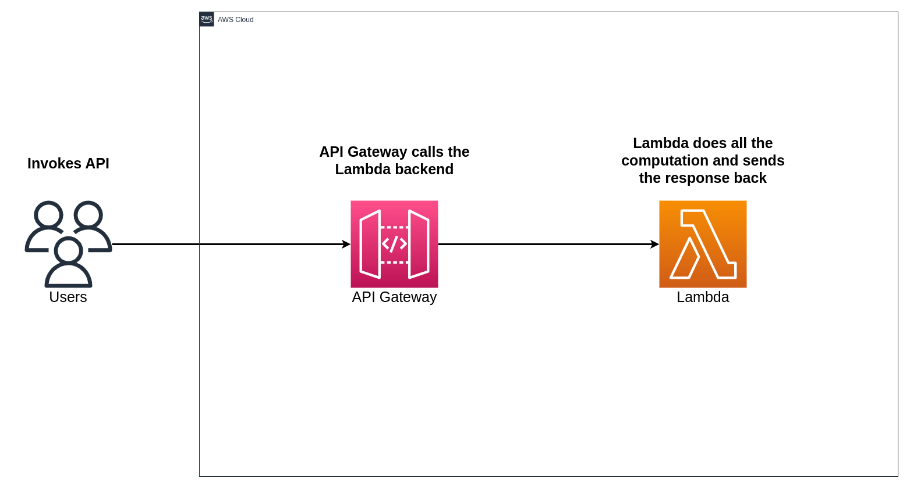

# API Gateway and Lambda Integration

## Video

## Introduction

- AWS API Gateway and Lambda functions enables developers to create highly efficient and flexible RESTful APIs. The seamless integration of these two services empowers businesses to deliver robust, scalable, and cost-effective solutions for a multitude of use cases.

## Project Statement

- In this project, we will explore the integration of AWS API Gateway and Lambda functions through the use of Get and Post methods. We will understand how they work in tandem to facilitate the creation of dynamic, serverless applications. This project aims to provide you with practical guidance needed to leverage this integration effectively.
- We'll walk you through the step-by-step process of setting up the API Gateway and Lambda integration using both methods, empowering you to build resilient and scalable applications that cater to the needs of the modern digital landscape. Whether you're building a small-scale web application or a large-scale enterprise solution, this powerful combination will undoubtedly be a game-changer in your cloud development toolkit.

## Architecture Diagram



## Project Walkthrough

- A user invokes the API which is hosted in the API Gateway with the Lambda serving as its backend. This Lambda function does the computation and give the response back to the API Gateway which in turn sends the response back to the user.

### GET Method

#### Lambda Function - GET

lambda_function.py

```py
import json

def lambda_handler(event, context):
    return "Hey There!, Welcome."
```

#### API Gateway - GET Method

Deployed API

[https://igu65hixj4.execute-api.us-east-1.amazonaws.com/Dev/heytherelambda](https://igu65hixj4.execute-api.us-east-1.amazonaws.com/Dev/heytherelambda)

---

### POST Method

#### Lambda Function - PUT

lambda_function.py

```py
import json

def lambda_handler(event, context):
    print(event)
    return 'Hi There, ' + event['Name']
```

#### API Gateway - Post Method

Deployed API

[https://cidp9rf265.execute-api.us-east-1.amazonaws.com/Dev/api-lambda-post-resource](https://cidp9rf265.execute-api.us-east-1.amazonaws.com/Dev/api-lambda-post-resource)

---
